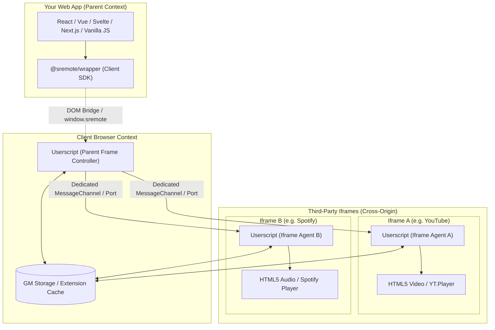

# 00. Architecture & Developer Overview

This guide is dedicated to Software Engineers and Frontend Developers seeking to integrate, control, or extend the **SRemote** platform within their web applications.

---

## 1. Technical Problem: The Cross-Origin Iframe Media Barrier

When building aggregation platforms, course management systems, multi-source playlist dashboards, or interactive media hubs, developers frequently embed third-party players inside `<iframe>` tags (e.g. YouTube, Spotify, SoundCloud, Vimeo, TikTok, Bilibili, Dailymotion, etc.).

Browsers enforce the **Same-Origin Policy** strictly:

```
❌ DOMException: Blocked a frame with origin "https://my-app.com" from accessing a cross-origin frame "https://youtube.com".
```

### Limitations of relying solely on isolated vendor SDKs:
1. **API Fragmentation**: Every service has its own custom loader and paradigms (YouTube requires `iframe_api`, Spotify needs OAuth Web Playback Tokens, SoundCloud uses a legacy Widget API).
2. **Lack of Lifecycle Coordination**: No built-in way to automatically synchronize state (e.g. pausing a YouTube video when a Spotify track begins).
3. **No Direct DOM or Style Access**: Parent pages cannot inject CSS, detect actual playback buffers, or subscribe to uniform media events.

---

## 2. The SRemote Solution Architecture

**SRemote** bridges this gap using a **Distributed Dual-Engine** architecture comprising two collaborating components:



---

## 3. Comparison: Userscript Engine vs. Wrapper Client SDK

| Characteristic | Userscript Engine (`@sremote/userscript`) | Wrapper Client SDK (`@sremote/wrapper`) |
| :--- | :--- | :--- |
| **Execution Environment** | Client browser extension (Tampermonkey, Violentmonkey, Greasemonkey...) | Bundled directly into your frontend application codebase via npm |
| **Core Responsibilities** | - Bypasses Cross-Origin barriers.<br>- Establishes private, encrypted `MessagePort` channels.<br>- Injects listeners directly into iframe `<video>`/`<audio>` and Player contexts. | - Exposes clean, ergonomic, 100% TypeScript APIs.<br>- Auto-detects userscript readiness.<br>- Automatically falls back to `dom-direct` for same-origin media.<br>- Provides ready-to-use installation modal UI. |
| **Bundle Size** | ~32KB Gzip (fully self-contained) | ~8KB Gzip (Zero dependencies) |
| **Distribution Formats** | UserScript `.user.js` | ESM, CommonJS, IIFE Bundles |

---

## 4. Client Operational Modes (`client.mode`)

Upon calling `createSRemoteClient()`, the SDK inspects its runtime environment and enters one of three operational modes:

```javascript
import { createSRemoteClient } from '@sremote/wrapper';

const client = createSRemoteClient({
  fallbackToDom: true, // Gracefully fallback to standard DOM for same-origin media
  timeout: 2000,       // Userscript detection timeout in ms
});

await client.ready();
console.log('Client operational mode:', client.mode);
```

- **`'userscript'`**: Connected to the Userscript Engine. Full cross-origin control capability over all iframes.
- **`'dom-direct'`**: Userscript is not installed, but media elements or iframes share the parent origin. Controlled via standard HTML5 Media APIs.
- **`'unsupported'`**: Userscript is missing and target media is cross-origin. You can display an installation prompt using `client.showInstallModal()`.

---

## 5. Domain-Driven Namespaces

SRemote eliminates flat namespace clutter by categorizing methods into clean subdomains:

```javascript
// 1. Quick Playback Controls (Auto-targets active instance)
await client.play();
await client.pause();
await client.seek(10); // Seek forward 10 seconds
await client.volume(0.8);

// 2. Instance & Multi-Mode Management (sremote.instances)
client.instances.setExclusive('auto'); // Auto-pause other media on play
const list = client.instances.list();  // List all connected instances
client.instances.assign('#video-1', 'slot-course-intro');

// 3. Custom Adapters for Proprietary Players (sremote.adapters)
client.adapters.register(myCustomPlayerAdapter, 'custom-player-id');

// 4. Two-Way RPC Calls (sremote.rpc)
const res = await client.rpc.call('getCapabilities');

// 5. Dynamic Iframe Styling (sremote.css)
await client.css.set('body { filter: contrast(1.1); }');

// 6. Global Event Subscriptions
client.on('timeupdate', ({ instanceId, state }) => {
  console.log(`[${instanceId}] Progress: ${state.currentTime}/${state.duration}`);
});
```

---

## 6. Recommended Integration Workflow

1. **Step 1**: Embed iframes with proper `allow="autoplay; encrypted-media; picture-in-picture"` attributes (See [01. Iframe Setup Guide](./01-iframe-setup.md)).
2. **Step 2**: Install `@sremote/wrapper`:
   ```bash
   npm install @sremote/wrapper
   ```
3. **Step 3**: Instantiate client and bind controls to your application's UI buttons and state management.
4. **Step 4**: Provide userscript installation modal prompt if `client.mode === 'unsupported'`.

---

## Next Steps
- 📖 [01. Iframe Setup Guide](./01-iframe-setup.md)
- 📊 [02. Compatibility & Service Matrix](./02-compatibility-check.md)
- 💻 [03. SRemote Wrapper Integration](./03-wrapper-integration.md)
