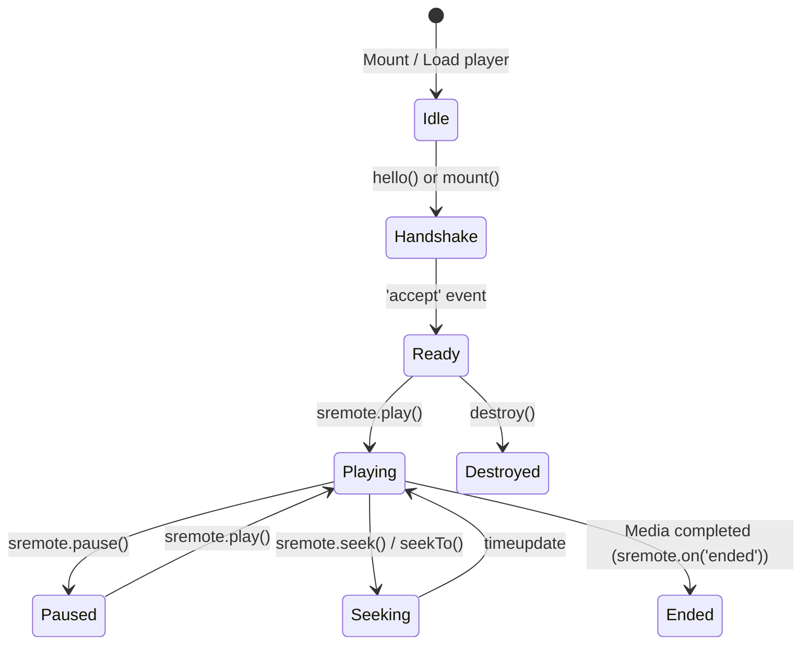

# Adapter Standardization & Event Lifecycle

One of the core philosophies of SRemote is: **Developers only need to learn a single, unified API standard to control every media player in the world.**

That standard is the **`HTML5MediaElement`** specification.

---

## 1. Adapter Standardization based on `HTML5MediaElement`

Every Adapter in the SRemote ecosystem (whether for YouTube, Vimeo, Spotify, or an in-house custom video player) conforms to the following standardized interfaces:

### A. Playback Controls
- **`play()`**: Starts media playback. Returns a Promise that resolves when the command is initiated.
- **`pause()`**: Pauses media playback.
- **`toggle()`**: Automatically toggles state: resumes if paused, pauses if currently playing.

### B. Seeking & Position
Resolves the fragmentation between disparate platform SDKs:
- **`getCurrentTime()`**: Retrieves the current playback position (in seconds).
- **`setCurrentTime(seconds)`**: Standard HTML5 method to set absolute playback time (e.g., jump to 30 seconds).
- **`seekTo(seconds)`**: Standard alias pointing directly to `setCurrentTime(seconds)` for compatibility with legacy player SDK habits.
- **`seek(deltaSeconds)`**: Relative seek based on current position.
  - `seek(10)`: Seek forward by 10 seconds.
  - `seek(-10)`: Seek backward by 10 seconds.

### C. Volume & Muting
- **`getVolume()`**: Returns normalized volume as a floating-point number in the range `[0.0 .. 1.0]`.
- **`setVolume(vol)`**: Sets the volume level (e.g., `0.8` represents 80%).
- **`getMuted()`**: Returns whether audio is muted (`true` / `false`).
- **`setMuted(boolean)`**: Sets or unsets the mute state.
- **`toggleMuted()`**: Toggles the mute state.

### D. State & Inspection
- **`getDuration()`**: Total duration of the media in seconds.
- **`isPaused()`**: Returns `true` if media is paused, `false` if playing.
- **`getState()`**: Returns a snapshot of the current playback state:
  ```typescript
  interface MediaState {
    paused: boolean;
    currentTime: number;
    duration: number;
    volume?: number;
    muted?: boolean;
    playbackRate?: number;
  }
  ```

---

## 2. Event Lifecycle

SRemote provides real-time event subscriptions via `sremote.on(eventName, handler)`.



### Common Lifecycle Events:
1. **`'accept'`**: Dispatched when an iframe or adapter successfully handshakes with the SRemote client.
2. **`'timeupdate'`**: Dispatched continuously during playback with updated `state.currentTime` and `state.duration`.
3. **`'play'` & `'pause'`**: Dispatched when playback state toggles.
4. **`'ended'`**: Dispatched when the media finishes.
5. **`'volumechange'`**: Dispatched when volume or mute state changes.

---

## 3. Lifecycle Management & Teardown (`destroy`)

To prevent memory leaks in Single Page Applications (React, Vue, Svelte, Angular):
- Every result returned by `provider.mount()` or `provider.create()` includes a **`destroy()`** function.
- Clean up when your component unmounts:
  ```javascript
  // Example in React useEffect cleanup:
  useEffect(() => {
    let cleanupFn;
    youtube.mount('#box', { videoId: '...' }).then(res => {
      cleanupFn = res.destroy;
    });

    return () => {
      cleanupFn?.(); // Safely removes listeners, tears down the instance, and cleans up the DOM
    };
  }, []);
  ```

---

## ⏭️ Next Steps
- Put it into practice with [Use-case 1: Embed 22 Platforms with Ready2Use](../use-cases/01-popular-players-ready2use.md).
