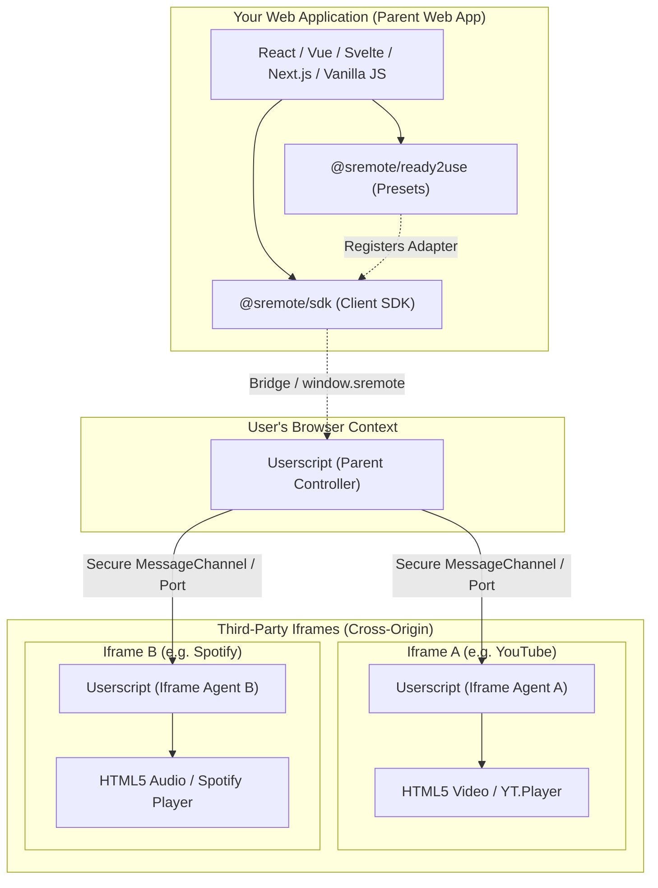

# Architecture Overview

**SRemote** is an open-source ecosystem designed to solve a fundamental challenge: **How can your web application securely and consistently communicate with, control, and synchronize any media player (video/audio) nested inside an `<iframe>`?**

---

## 1. The Core Problem: "Why SRemote?"

If you have ever integrated and controlled third-party video or audio players, you know the frustration:

> *"Imagine you need to build a web application that embeds **YouTube, SoundCloud, NicoNico, and Bilibili** side-by-side:  
> - **YouTube** requires loading their `iframe_api` script and calling `player.seekTo()`.  
> - **SoundCloud** requires the Widget API with its own unique event protocol.  
> - **NicoNico** communicates via Japanese postMessage schemas.  
> - The final blow: **Bilibili provides no player SDK whatsoever** for external web controllers!  
> 
> Each provider has its own distinct API, the Same-Origin Policy blocks direct DOM access, and audio streams collide uncontrollably. Eliminating these headaches is exactly why SRemote was created."*

### Key Obstacles Every Frontend Developer Faces:
1. **Severely Fragmented APIs**: Every platform requires a distinct SDK. One calls it `seekTo()`, another `setCurrentTime()`, and another `seek()`.
2. **The Same-Origin Policy (CORS) Wall**: Modern browsers strictly block any attempt from the parent page to access or inspect the DOM inside cross-origin `<iframe>` elements:
   ```
   ❌ DOMException: Blocked a frame with origin "https://my-app.com" from accessing a cross-origin frame.
   ```
3. **Lack of Centralized Orchestration**: No built-in mechanism exists to automatically pause a Spotify track when a user plays a YouTube video.
4. **Helplessness with View-Only Embeds**: Platforms like Bilibili and many embed-only players only provide iframes for visual playback, offering no remote Play/Pause API for external sites.

---

## 2. Solution Architecture: Distributed Dual-Engine

SRemote resolves these constraints using a **Dual-Engine** architecture coordinating two essential components:



### Clear Division of Responsibilities:
1. **Universal Client SDK (`@sremote/sdk`)**:
   - Integrated directly into your frontend application codebase via npm.
   - Provides an object-oriented, Promise-based API with 100% TypeScript support.
   - Automatically probes the execution environment to pick the optimal control strategy.
2. **Userscript Engine (`@sremote/userscript`)**:
   - Installed in the user's browser (via Tampermonkey, Violentmonkey, etc.).
   - Acts as a Cross-Origin Bridge: Listens to commands from the parent page and directly manipulates the `<video>` / `<audio>` elements or player contexts inside the iframe via isolated `MessagePort` channels.

---

## 3. Three Automatic Operating Modes (`client.mode`)

Upon initialization, `@sremote/sdk` automatically tests the environment and engages one of three operating modes:

```javascript
import { createSRemoteClient } from '@sremote/sdk';

const client = createSRemoteClient();
await client.ready();

console.log('Current Operating Mode:', client.mode);
```

| Mode (`client.mode`) | Trigger Condition | Control Mechanism |
| :--- | :--- | :--- |
| **`'userscript'`** | The browser has the SRemote Userscript installed | Bypasses all cross-origin barriers with full control over all cross-domain iframes. |
| **`'dom-direct'`** | Same-origin iframes or `<video>` / `<audio>` elements hosted directly on the main page | Controls media directly through native DOM APIs without requiring users to install a Userscript. |
| **`'unsupported'`** | Cross-origin iframe and no Userscript is present in the browser | Direct control is restricted by CORS. You can call `client.showInstallModal()` to display a polite, customizable install prompt. |

---

## 4. Four Progressive Implementation Levels

To guide your implementation based on exact application needs, the guides are organized into 4 practical use cases:

1. **Use-case 1 (Recommended for most apps)**: Use **`@sremote/ready2use`** to embed 22 popular platforms (YouTube, Vimeo, Spotify...). Runs immediately via third-party official SDKs without requiring a Userscript.
2. **Use-case 2**: Write a **Custom Adapter** for an in-house or specialized player using built-in `Polyfills`.
3. **Use-case 3**: Use SRemote to orchestrate native `<video>` / `<audio>` elements directly on your site (**Same-Origin Direct Media**).
4. **Use-case 4**: Control complex, cross-origin iframes by combining with the **Userscript Engine**.

---

## ⏭️ Next Steps
- Read [Adapter Standardization & Event Lifecycle](./adapter-and-lifecycle.md) to understand how SRemote normalizes playback operations.
