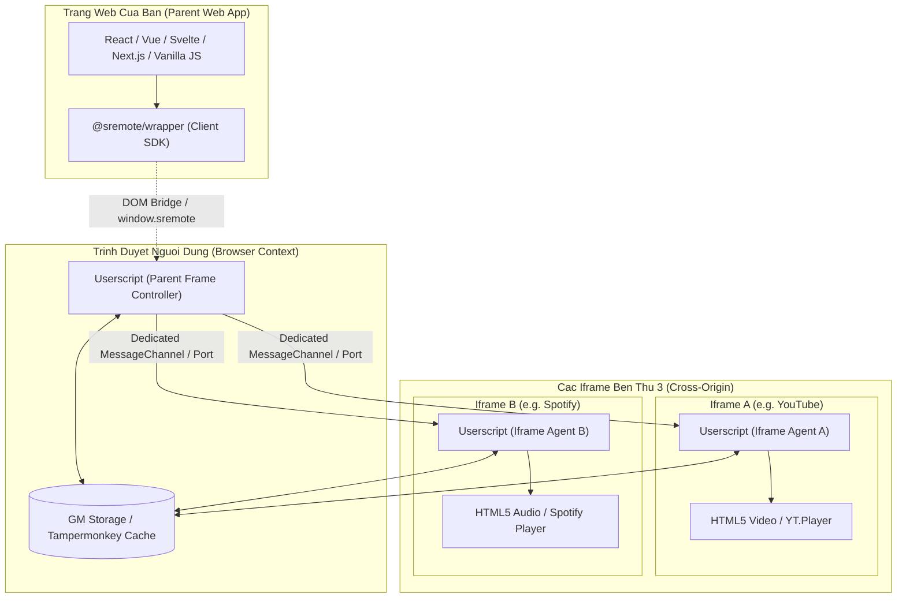

# 00. Tổng quan Kiến trúc cho Lập trình viên (Developer Overview)

Tài liệu này dành riêng cho các kỹ sư phát triển phần mềm (Web Developers / Frontend Engineers) muốn tích hợp, điều khiển hoặc mở rộng hệ thống **SRemote** trên website hoặc ứng dụng web của mình.

---

## 1. Bài toán kỹ thuật: Rào cản Cross-Origin Iframe Media

Khi xây dựng các website tổng hợp, nền tảng khóa học, playlist đa nguồn hoặc dashboard media, lập trình viên thường nhúng các player bên thứ ba qua thẻ `<iframe>` (ví dụ YouTube, Spotify, SoundCloud, Vimeo, TikTok, Bilibili, Dailymotion...).

Lúc này, trình duyệt áp dụng nghiêm ngặt chính sách **Same-Origin Policy**:

```
❌ DOMException: Blocked a frame with origin "https://my-app.com" from accessing a cross-origin frame "https://youtube.com".
```

### Các hạn chế khi chỉ dùng SDK rời rạc của từng dịch vụ:
1. **Phân mảnh API & Payload**: Mỗi dịch vụ có một cách khởi tạo riêng (YouTube cần nhúng `iframe_api`, Spotify yêu cầu Token OAuth Web Playback, SoundCloud dùng Widget API).
2. **Không đồng nhất trạng thái**: Không có cơ chế quản lý vòng đời chung (ví dụ: tự động tạm dừng Video A trên YouTube khi người dùng bấm phát Nhạc B trên Spotify).
3. **Giới hạn tùy biến UI**: Trang cha hoàn toàn không thể can thiệp CSS, kiểm tra buffer ngầm hay bắt các sự kiện media đồng nhất.

---

## 2. Giải pháp Kiến trúc SRemote

**SRemote** giải quyết triệt để bài toán trên bằng mô hình **Distributed Dual-Engine** (Động cơ kép phân tán) gồm 2 thành phần phối hợp:



---

## 3. So sánh vai trò: Userscript Engine vs. Wrapper Client SDK

| Tiêu chí | Userscript Engine (`@sremote/userscript`) | Wrapper Client SDK (`@sremote/wrapper`) |
| :--- | :--- | :--- |
| **Nơi chạy** | Tiện ích mở rộng trình duyệt (Tampermonkey, Violentmonkey, Greasemonkey...) của người dùng cuối | Đóng gói trực tiếp trong mã nguồn frontend website của bạn qua npm |
| **Trọng tâm nhiệm vụ** | - Đột phá rào cản Cross-Origin.<br>- Thiết lập kênh truyền `MessagePort` bảo mật.<br>- Bắt sự kiện trực tiếp từ thẻ `<video>`, `<audio>` hoặc can thiệp Player context bên trong Iframe. | - Cung cấp API hướng đối tượng, tiện dụng, 100% TypeScript.<br>- Tự động nhận diện Userscript.<br>- Fallback sang `dom-direct` nếu chạy cùng domain.<br>- Cung cấp modal UI hướng dẫn cài Userscript cho người dùng. |
| **Kích thước** | ~32KB Gzip (độc lập, tối ưu hoá cao) | ~8KB Gzip (Zero dependencies) |
| **Định dạng đóng gói** | UserScript `.user.js` | ESM, CommonJS, IIFE Bundle |

---

## 4. Các Chế độ hoạt động của Client (`client.mode`)

Khi khởi tạo `createSRemoteClient()`, SDK sẽ tự động kiểm tra môi trường và hoạt động ở một trong 3 chế độ:

```javascript
import { createSRemoteClient } from '@sremote/wrapper';

const client = createSRemoteClient({
  fallbackToDom: true, // Tự động fallback sang direct DOM nếu cùng domain
  timeout: 2000,       // Thời gian chờ phát hiện userscript
});

await client.ready();
console.log('Chế độ hoạt động:', client.mode);
```

- **`'userscript'`**: Đã kết nối với Userscript Engine. Có toàn quyền điều khiển xuyên domain với mọi Iframe bảo mật cao.
- **`'dom-direct'`**: Userscript chưa cài nhưng Iframe cùng domain hoặc media nằm trực tiếp trên trang cha. Client tự động chuyển sang điều khiển bằng HTML5 Media Element API tiêu chuẩn.
- **`'unsupported'`**: Userscript không khả dụng và không thể can thiệp DOM trực tiếp (khác domain). Lúc này bạn có thể kích hoạt modal nhắc người dùng cài userscript qua `client.showInstallModal()`.

---

## 5. Cấu trúc API được tổ chức theo Domain

SRemote loại bỏ sự lộn xộn của flat API bằng cách chia các phương thức quản lý theo từng Domain rõ ràng:

```javascript
// 1. Điều khiển phát nhanh (Tự động áp dụng cho instance đang active)
await client.play();
await client.pause();
await client.seek(10); // Tua tới 10s
await client.volume(0.8);

// 2. Quản lý Instance & Multi-mode (sremote.instances)
client.instances.setExclusive('auto'); // Tự dừng video khác khi có 1 video phát
const list = client.instances.list();  // Liệt kê mọi frame đang kết nối
client.instances.assign('#video-1', 'slot-course-intro');

// 3. Đăng ký Custom Adapter cho Player đặc thù (sremote.adapters)
client.adapters.register(myCustomPlayerAdapter, 'custom-player-id');

// 4. Giao tiếp RPC hai chiều (sremote.rpc)
const res = await client.rpc.call('getCapabilities');

// 5. Tùy biến CSS Iframe động (sremote.css)
await client.css.set('body { filter: contrast(1.1); }');

// 6. Lắng nghe sự kiện toàn cục
client.on('timeupdate', ({ instanceId, state }) => {
  console.log(`[${instanceId}] Tiến độ: ${state.currentTime}/${state.duration}`);
});
```

---

## 6. Luồng tích hợp chuẩn cho ứng dụng của bạn

1. **Bước 1**: Nhúng thẻ Iframe với đầy đủ quyền `allow="autoplay; encrypted-media; picture-in-picture"` (Xem chi tiết tại [01. Tạo thẻ Iframe đúng chuẩn](./01-iframe-setup.md)).
2. **Bước 2**: Cài đặt `@sremote/wrapper` vào dự án:
   ```bash
   npm install @sremote/wrapper
   ```
3. **Bước 3**: Khởi tạo client, liên kết sự kiện UI với các hàm điều khiển `client.play()`, `client.pause()`, `client.seek()`.
4. **Bước 4**: Thêm nút cài đặt Userscript tiện dụng cho người dùng cuối nếu `client.mode === 'unsupported'`.

---

## Tiếp theo
- 📖 [01. Cách tạo thẻ `<iframe>` đúng chuẩn](./01-iframe-setup.md)
- 📊 [02. Kiểm tra tính tương thích & Bảng dịch vụ](./02-compatibility-check.md)
- 💻 [03. Hướng dẫn tích hợp SRemote Wrapper](./03-wrapper-integration.md)
