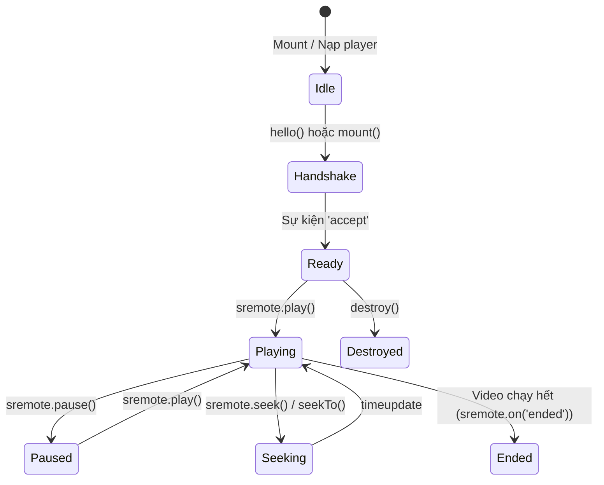

# Chuẩn hóa Adapter & Vòng đời sự kiện (Adapter & Lifecycle)

Một trong những triết lý cốt lõi của SRemote là: **Lập trình viên chỉ cần học một chuẩn API duy nhất để điều khiển mọi loại trình phát trên thế giới.**

Chuẩn API đó chính là mô hình **`HTML5MediaElement`**.

---

## 1. Chuẩn hóa Adapter theo `HTML5MediaElement`

Mọi Adapter trong hệ sinh thái SRemote (dù là YouTube, Vimeo, Spotify, hay một Video Player tự phát triển) đều tuân theo các giao diện chuẩn sau:

### A. Nhóm điều khiển phát (Playback)
- **`play()`**: Bắt đầu phát media. Trả về Promise hoàn thành khi lệnh được thực thi.
- **`pause()`**: Tạm dừng phát media.
- **`toggle()`**: Tự động đảo ngược trạng thái: nếu đang tạm dừng thì phát tiếp, nếu đang phát thì tạm dừng.

### B. Nhóm vị trí & tua (Seeking)
Để khắc phục tình trạng phân mảnh giữa các thư viện:
- **`getCurrentTime()`**: Lấy vị trí phát hiện tại (tính bằng giây).
- **`setCurrentTime(seconds)`**: Phương thức chuẩn của HTML5 để đặt vị trí phát tuyệt đối (ví dụ nhảy đến giây thứ 30).
- **`seekTo(seconds)`**: Alias tiêu chuẩn trỏ trực tiếp đến `setCurrentTime(seconds)` để tương thích với thói quen của các SDK cũ.
- **`seek(deltaSeconds)`**: Tua tương đối so với vị trí hiện tại.
  - `seek(10)`: Tua tiến 10 giây.
  - `seek(-10)`: Tua lùi 10 giây.

### C. Nhóm âm lượng & tiếng (Volume & Mute)
- **`getVolume()`**: Trả về mức âm lượng chuẩn hóa trong khoảng số thực `[0.0 .. 1.0]`.
- **`setVolume(vol)`**: Đặt âm lượng (ví dụ `0.8` tương đương 80%).
- **`getMuted()`**: Kiểm tra trạng thái tắt tiếng (`true` / `false`).
- **`setMuted(boolean)`**: Bật hoặc tắt chế độ im lặng.
- **`toggleMuted()`**: Đảo trạng thái tắt/bật tiếng.

### D. Nhóm trạng thái (State & Inspection)
- **`getDuration()`**: Tổng thời lượng của bài hát/video (tính bằng giây).
- **`isPaused()`**: Trả về `true` nếu media đang dừng, `false` nếu đang phát.
- **`getState()`**: Trả về ảnh chụp trạng thái (Snapshot):
  ```typescript
  interface MediaState {
    paused: boolean;
    currentTime: number;
    duration: number;
    volume?: number;
    muted?: boolean;
    playbackRate?: number;
  }
  ```

---

## 2. Vòng đời sự kiện (Event Lifecycle)

SRemote cung cấp cơ chế lắng nghe sự kiện thời gian thực thông qua hàm `sremote.on(eventName, handler)`.



### Các sự kiện phổ biến nhất:
1. **`'accept'`**: Phát ra khi Iframe hoặc Adapter kết nối thành công với SRemote client.
2. **`'timeupdate'`**: Phát ra liên tục theo tiến độ phát của media (kèm `state.currentTime` và `state.duration`).
3. **`'play'` & `'pause'`**: Phát ra khi trạng thái phát thay đổi.
4. **`'ended'`**: Phát ra khi video/bài hát kết thúc.
5. **`'volumechange'`**: Phát ra khi âm lượng hoặc cờ tắt tiếng bị thay đổi.

---

## 3. Quản lý vòng đời & Dọn dẹp (`destroy`)

Để ngăn chặn rò rỉ bộ nhớ (memory leak) trong các Single Page Application (React, Vue, Svelte, Angular):
- Mọi kết quả trả về từ `provider.mount()` hoặc `provider.create()` đều đính kèm hàm **`destroy()`**.
- Khi component bị tháo gỡ (unmount):
  ```javascript
  // Trong React useEffect cleanup:
  useEffect(() => {
    let cleanupFn;
    youtube.mount('#box', { videoId: '...' }).then(res => {
      cleanupFn = res.destroy;
    });

    return () => {
      cleanupFn?.(); // Gỡ listener, hủy instance và xóa thẻ iframe an toàn
    };
  }, []);
  ```

---

## ⏭️ Bước tiếp theo
- Đi vào thực hành cụ thể với [Use-case 1: Nhúng 22 nền tảng với Ready2Use](../use-cases/01-popular-players-ready2use.md).
