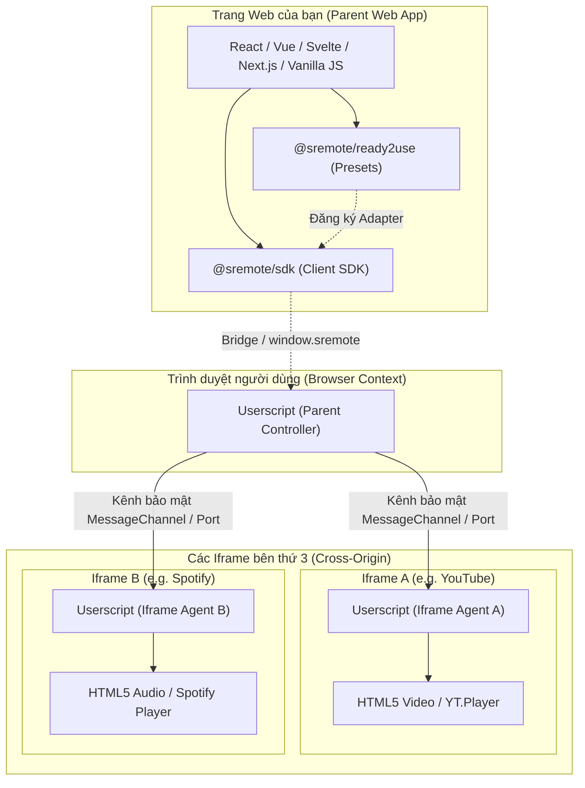

# Kiến trúc tổng quan (Architecture Overview)

**SRemote** là một hệ sinh thái mã nguồn mở được thiết kế nhằm giải quyết bài toán: **Làm sao để trang web của bạn có thể giao tiếp, điều khiển và đồng bộ hóa mọi trình phát media (video/audio) nằm bên trong thẻ `<iframe>` một cách an toàn và đồng nhất?**

---

## 1. Nỗi đau thực tế: "Tại sao SRemote ra đời?"

Nếu bạn từng nghĩ việc nhúng và điều khiển một hay hai trình phát video/audio đã đủ mệt mỏi, thì hãy nhìn vào bài toán thực tế này:

> *"Hãy thử tưởng tượng bạn cần xây dựng một trang web nhúng đồng thời **YouTube, SoundCloud, NicoNico và Bilibili**.  
> - **YouTube** bắt nạp script `iframe_api` và gọi `player.seekTo()`.  
> - **SoundCloud** yêu cầu Widget API với giao thức riêng.  
> - **NicoNico** lại giao tiếp qua postMessage kiểu Nhật.  
> - Cú chốt hạ cay đắng nhất: **Bilibili hoàn toàn không có SDK** cho trang ngoài điều khiển!  
> 
> Mỗi ông một phách, API manh mún, chính sách Same-Origin chặn họng, âm thanh thì đè nhau hỗn loạn. Dẹp những rắc rối 'trời ơi đất hỡi' ấy chính là lý do SRemote ra đời!"*

### Những rào cản kinh điển mà mọi frontend dev đều gặp phải:
1. **API bị phân mảnh nghiêm trọng**: Mỗi nhà cung cấp bắt nạp một thư viện riêng, hàm thì đặt là `seekTo()`, hàm thì `setCurrentTime()`, hàm thì lại là `seek()`.
2. **Bức tường Same-Origin Policy (Cross-Origin)**: Trình duyệt chặn đứng mọi nỗ lực can thiệp từ trang cha vào DOM bên trong thẻ `<iframe>`:
   ```
   ❌ DOMException: Blocked a frame with origin "https://my-app.com" from accessing a cross-origin frame.
   ```
3. **Thiếu cơ chế điều phối tập trung**: Không có cách nào tự động dừng bài hát Spotify khi người dùng vừa bấm phát một video YouTube.
4. **Bất lực với các dịch vụ không cung cấp Player SDK**: Điển hình như Bilibili và nhiều trang video khác — họ chỉ cho nhúng iframe để xem chứ không cho API để bấm Play/Pause từ xa.

---

## 2. Kiến trúc giải pháp: Distributed Dual-Engine

SRemote giải quyết triệt để rào cản trên bằng kiến trúc **Dual-Engine** phối hợp giữa hai thành phần:



### Phân chia vai trò rõ ràng:
1. **Universal Client SDK (`@sremote/sdk`)**:
   - Được nhúng trực tiếp vào dự án frontend của bạn qua npm.
   - Cung cấp giao diện lập trình Promise-based hiện đại, hướng đối tượng, hỗ trợ 100% TypeScript.
   - Tự động nhận diện môi trường để chọn phương án điều khiển tối ưu nhất.
2. **Userscript Engine (`@sremote/userscript`)**:
   - Cài đặt trên trình duyệt người dùng (qua Tampermonkey, Violentmonkey...).
   - Đóng vai trò cầu nối xuyên miền (Cross-Origin Bridge): Lắng nghe từ trang cha và điều khiển trực tiếp thẻ `<video>` / `<audio>` bên trong iframe thông qua các kênh truyền `MessagePort` độc lập.

---

## 3. Ba chế độ hoạt động tự động (`client.mode`)

Khi khởi tạo `@sremote/sdk`, SDK sẽ tự động thăm dò và kích hoạt một trong ba chế độ phù hợp:

```javascript
import { createSRemoteClient } from '@sremote/sdk';

const client = createSRemoteClient();
await client.ready();

console.log('Chế độ hoạt động hiện tại:', client.mode);
```

| Chế độ (`client.mode`) | Điều kiện kích hoạt | Cơ chế điều khiển |
| :--- | :--- | :--- |
| **`'userscript'`** | Trình duyệt đã cài SRemote Userscript | Vượt qua mọi rào cản Cross-Origin, toàn quyền điều khiển mọi iframe xuyên domain. |
| **`'dom-direct'`** | Iframe cùng domain hoặc thẻ `<video>`/`<audio>` nằm ngay trên trang chính | Điều khiển trực tiếp qua DOM API mà **không đòi hỏi** người dùng phải cài Userscript. |
| **`'unsupported'`** | Iframe khác domain và trình duyệt chưa cài Userscript | Giới hạn điều khiển trực tiếp. Lúc này bạn có thể gọi `client.showInstallModal()` để hiển thị modal hướng dẫn cài đặt trực quan. |

---

## 4. Bốn nấc tiếp cận trong thực tế

Để giúp bạn áp dụng SRemote đúng nhu cầu, tài liệu hướng dẫn được chia thành 4 use-case từ đơn giản đến chuyên sâu:

1. **Use-case 1 (Khuyên dùng cho hầu hết ứng dụng)**: Dùng **`@sremote/ready2use`** để nhúng 22 nền tảng phổ biến (YouTube, Vimeo, Spotify...). Chạy ngay qua SDK bên thứ 3 mà không cần quan tâm đến Userscript.
2. **Use-case 2**: Tự viết **Custom Adapter** cho một Player chuyên biệt bằng bộ trợ năng `Polyfills`.
3. **Use-case 3**: Sử dụng SRemote để quản lý các thẻ `<video>` / `<audio>` ngay trên trang chính (**Same-Origin Direct Media**).
4. **Use-case 4**: Điều khiển các Iframe phức tạp khác domain bằng cách kết hợp **Userscript Engine**.

---

## ⏭️ Bước tiếp theo
- Xem [Chuẩn hóa Adapter & Vòng đời sự kiện](./adapter-and-lifecycle.md) để hiểu cách SRemote chuẩn hóa mọi thao tác playback.
