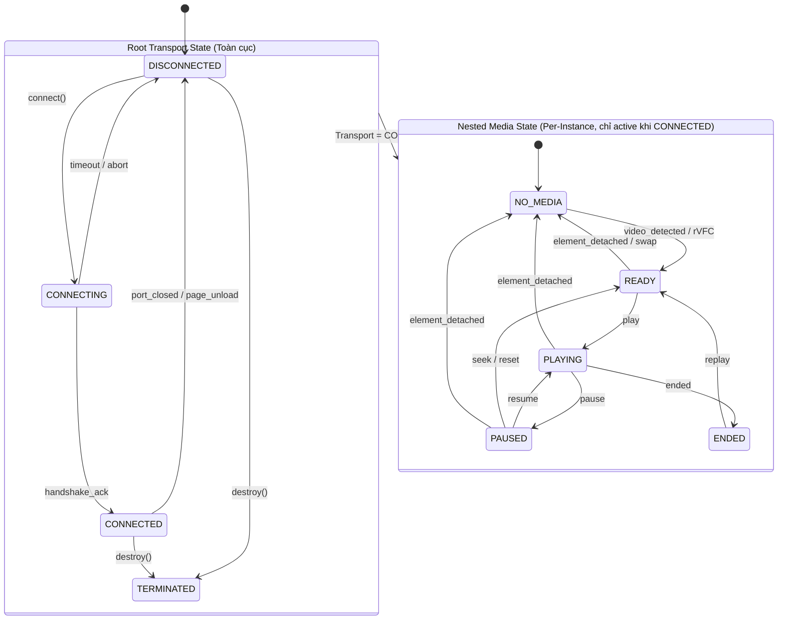
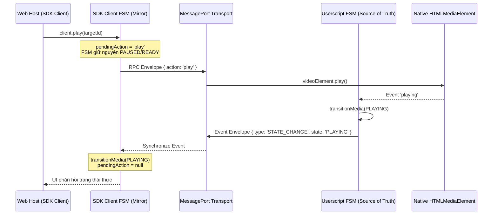

# Tài liệu Thiết kế Kiến trúc: Zero-Dependency Hierarchical FSM Engine

> **Trạng thái:** Bản thảo Đề xuất Kiến trúc (Architecture Design Document)  
> **Áp dụng cho:** `@sremote/shared`, `@sremote/sdk`, `@sremote/userscript` (v4.0+)  
> **Mục tiêu:** Loại bỏ triệt để race conditions, ghost states, rò rỉ listener và các vòng lặp timer polling khi quản lý vòng đời Media xuyên nguồn (Cross-Origin).

---

## 1. Bối cảnh & Vấn đề Cốt lõi (Background & Problem Statement)

Trong các phiên bản v3.x trở về trước của SRemote:
- **Heuristics & Flag-based State**: Trạng thái kết nối và trạng thái video được theo dõi rời rạc qua các biến cờ boolean (`isReady`, `connected`, `hasMedia`) và các hàm kiểm tra `setInterval` lặp lại vô tận.
- **Race Condition khi Swap Video**: Khi một iframe đổi video (như Single Page App trên YouTube đổi bài hát trong cùng một thẻ `<video>` hoặc hủy thẻ cũ tạo thẻ mới), các sự kiện `pause`, `play`, `loadstart` bắn đè lên nhau khiến SDK client bị kẹt ở trạng thái cũ hoặc nhầm lẫn giữa việc iframe bị mất kết nối (`DISCONNECTED`) với việc video tạm thời bị gỡ khỏi DOM (`NO_MEDIA`).
- **Thiếu tính tiền định (Non-deterministic)**: Không có quy tắc chuyển trạng thái hợp lệ, dẫn đến việc SDK có thể bắn lệnh `play()` ngay khi kết nối vật lý `MessagePort` còn chưa kịp bắt tay xong.

---

## 2. Kiến trúc Phân cấp (Hierarchical State Architecture)

Hệ thống FSM được tổ chức theo **mô hình phân cấp 2 tầng (Two-Level Hierarchy)**:



### 2.1. Tầng 1: Root Transport State (Toàn cục)
Quản lý trạng thái kênh truyền vật lý (Window Event, MessagePort, Bridge).
- **`DISCONNECTED`**: Chưa thiết lập kênh truyền.
- **`CONNECTING`**: Đang trong quá trình bắt tay handshake (chờ announce event hoặc challenge response).
- **`CONNECTED`**: Kênh truyền hai chiều đã thông suốt, sẵn sàng vận chuyển RPC envelope.
- **`TERMINATED`**: Kênh truyền bị hủy vĩnh viễn (unmount, destroy).

### 2.2. Tầng 2: Nested Media State (Theo từng Instance)
Chỉ kích hoạt khi Root Transport đang ở trạng thái `CONNECTED`. Nếu Transport rơi về `DISCONNECTED`, Media State lập tức reset về `NONE`.
- **`NO_MEDIA`**: Kênh truyền kết nối tốt, nhưng trong frame chưa tìm thấy thẻ `<video>`/`<audio>` hoặc thẻ cũ vừa bị gỡ khỏi DOM.
- **`READY`**: Thẻ media đã mount vào DOM, nạp xong metadata cơ bản (`readyState >= 2`), sẵn sàng nhận lệnh.
- **`PLAYING`**: Media đang thực sự phát frame/audio.
- **`PAUSED`**: Media đang tạm dừng.
- **`ENDED`**: Media đã phát hết thời lượng.

---

## 3. Cơ chế Đồng bộ & Phân chia Thực thể (Sync & Topology)

Dựa trên các quyết định kiến trúc đã thống nhất:



### 3.1. Userscript là Nguồn Sự Thật (Source of Truth)
- Userscript (nơi trực tiếp gắn `MutationObserver` và event listeners lên `<video>`) là **Master FSM**.
- SDK Client chỉ sở hữu một **Mirror FSM** phản chiếu. Trạng thái của Mirror FSM hoàn toàn do sự kiện từ Master FSM kích hoạt, tránh việc client "ảo tưởng" trạng thái khi trình duyệt chặn chính sách Autoplay.

### 3.2. Cờ `pendingAction` (Tránh UI Flicker)
- Khi SDK phát lệnh (ví dụ `play()`), FSM không tự ý nhảy cóc sang `PLAYING` (không dùng optimistic thuần túy).
- Thay vào đó, FSM ghi nhận `pendingAction: 'play'`.
- Thuộc tính `fsm.state` sẽ bộc lộ:
  ```javascript
  {
    transport: 'CONNECTED',
    media: 'PAUSED',
    pendingAction: 'play', // Giao diện có thể hiển thị spinner loading nhẹ
    isReady: true
  }
  ```
- Khi Userscript xác nhận sự kiện `playing`, FSM chính thức chuyển sang `PLAYING` và xóa cờ `pendingAction`.

### 3.3. Cấu trúc Multi-Instance
- **1 Global Transport FSM**: Quản lý trạng thái kết nối tổng thể của trang mẹ với Userscript host.
- **Map<instanceId, InstanceMediaFSM>**: Mỗi iframe/player instance giữ một Media Sub-FSM độc lập. Player A có thể đang `PLAYING` trong khi Player B đang `PAUSED` hoặc `NO_MEDIA`.

---

## 4. Đặc tả Kỹ thuật của FSM Engine (`@sremote/shared`)

Engine được thiết kế siêu gọn (~80 dòng code, không dependencies) nhưng trang bị đầy đủ các tính năng:

### 4.1. Transition Guards (`beforeTransition`)
Cho phép đăng ký hook chặn chuyển trạng thái không an toàn:
```javascript
fsm.beforeTransition((from, to, context) => {
  // Ví dụ: Không cho phép chuyển sang PLAYING nếu chưa có sự đồng ý của người dùng / passkey
  if (to === MediaState.PLAYING && !context.hasUserGesture && context.isAutoplayBlocked) {
    return false; // Abort transition
  }
  return true;
});
```

### 4.2. State Transition History Buffer & Triggers (Khả năng Quan sát & Debug)
Mọi lần chuyển đổi trạng thái bắt buộc phải đi kèm với một `trigger` hợp lệ được định nghĩa nghiêm ngặt trong hằng số `FSM_TRIGGERS` (phân tầng theo domain `transport:*` và `media:*`):

```javascript
export const FSM_TRIGGERS = Object.freeze({
  // Transport Triggers
  TRANSPORT_READY_CALL: 'transport:ready_call',
  TRANSPORT_DRIVER_READY: 'transport:driver_ready',
  TRANSPORT_HANDSHAKE_TIMEOUT: 'transport:handshake_timeout',
  TRANSPORT_DISCONNECT: 'transport:disconnect',
  TRANSPORT_TERMINATE: 'transport:terminate',

  // Media Triggers
  MEDIA_MOUNT: 'media:mount',
  MEDIA_UNMOUNT: 'media:unmount',
  MEDIA_PLAYING_EVENT: 'media:playing_event',
  MEDIA_PAUSE_EVENT: 'media:pause_event',
  MEDIA_ENDED_EVENT: 'media:ended_event',
  MEDIA_READY_EVENT: 'media:ready_event',
});
```

Chữ ký hàm chuyển trạng thái bắt buộc:
```javascript
fsm.transitionTransport(nextState, trigger, meta = {});
fsm.transitionMedia(nextState, trigger, meta = {});
```
*(Nếu `trigger` không thuộc `FSM_TRIGGERS`, FSM sẽ thực hiện Strict Validation: từ chối transition hoặc ném Error để ngăn chặn các trạng thái không rõ nguồn gốc).*

Circular Buffer lưu trữ **10 lần chuyển trạng thái gần nhất**:
```javascript
history = [
  { from: 'DISCONNECTED', to: 'CONNECTING', trigger: FSM_TRIGGERS.TRANSPORT_READY_CALL, timestamp: 1726750000100 },
  { from: 'CONNECTING', to: 'CONNECTED', trigger: FSM_TRIGGERS.TRANSPORT_DRIVER_READY, timestamp: 1726750000150 },
  { from: 'NO_MEDIA', to: 'READY', trigger: FSM_TRIGGERS.MEDIA_MOUNT, timestamp: 1726750000200 },
  { from: 'READY', to: 'PLAYING', trigger: FSM_TRIGGERS.MEDIA_PLAYING_EVENT, timestamp: 1726750000500 }
];
```
- Expose qua `sremote.debug.dumpFSM()` trên SDK để lập trình viên có thể dump ngay ra console khi cần tìm hiểu nguyên nhân xung đột hoặc trễ lệnh.

---

## 5. Bảng Điều Phối Lệnh An toàn (`canExecute(action)`)

FSM bảo vệ tầng thực thi lệnh bằng cách chặn hoặc đưa vào micro Auto-Queue các action không phù hợp với ngữ cảnh:

| Trạng thái FSM hiện tại | Lệnh Hợp lệ (Cho phép thực thi) | Lệnh Bị Chặn / Đệm vào Auto-Queue |
| :--- | :--- | :--- |
| **`DISCONNECTED` / `CONNECTING`** | `hello`, `scan`, `on`, `off` | Toàn bộ lệnh media: `play`, `pause`, `seek`, `volume`... *(Đệm vào Auto-Queue tối đa 2s)* |
| **`CONNECTED` + `NO_MEDIA`** | `list`, `capabilities`, `assign`, `css`, `note` | Các lệnh playback: `play`, `pause`, `seek`, `volume`, `speed`... *(Báo lỗi hoặc chờ video mount)* |
| **`CONNECTED` + `READY`** | Mọi lệnh playback, `play`, `seek`, `volume`, `speed`... | Không có |
| **`CONNECTED` + `PLAYING`** | Mọi lệnh, `pause`, `seek`, `volume`, `speed`... | Không có |
| **`CONNECTED` + `PAUSED`** | Mọi lệnh, `play`, `seek`, `volume`, `speed`... | Không có |
| **`TERMINATED`** | Không cho phép lệnh nào | Toàn bộ (Throw `InstanceTerminatedError`) |

---

## 6. Lộ trình Triển khai (Implementation Phases)

1. **Giai đoạn 1 (Đã hoàn thành ở v4.0-alpha.1):**
   - Xây dựng lớp nền `HierarchicalFSM` tại `@sremote/shared/src/state/fsm.js`.
   - Tạo `ConnectionManager` độc lập điều phối Root Transport.
   - Tích hợp Auto-Queue và JIT Cache trên SDK Client.

2. **Giai đoạn 2 (Hoàn thiện v4.0):**
   - Bổ sung Transition Guards (`beforeTransition`) và Circular History Buffer (`dumpHistory()`).
   - Cập nhật FSM vào Userscript Iframe controller để làm Source of Truth.
   - Thêm cờ `pendingAction` khi SDK client nhận lệnh gọi từ app host.
