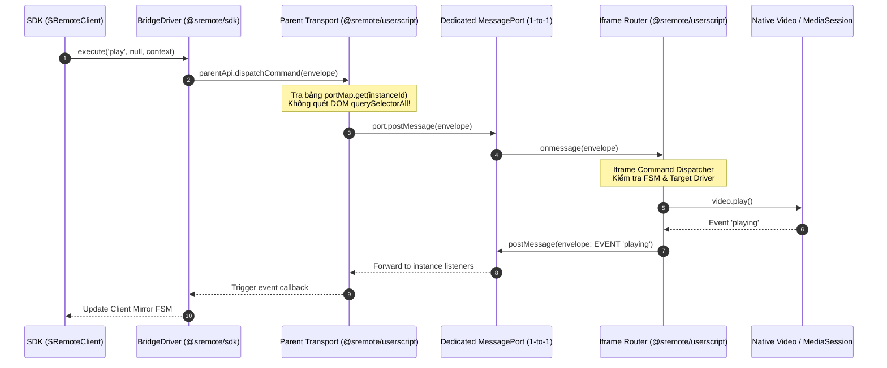

# Tài liệu Thiết kế Kiến trúc: Micro-Kernel Protocol Envelope & Hệ thống Giao tiếp BridgeDriver - Userscript

> **Trạng thái:** Bản thảo Đề xuất Kiến trúc (Architecture Design Document & Refactoring Plan)  
> **Áp dụng cho:** `@sremote/sdk` (BridgeDriver), `@sremote/shared` (Protocol Envelope), `@sremote/userscript` (Parent Transport & Iframe Controller)  
> **Mục tiêu:** Thay thế cơ chế postMessage chuỗi thô (`sremote:${action}`) bằng chuẩn **Micro-Kernel Protocol Envelope** bất biến; xóa bỏ việc quét đệ quy DOM (`root.querySelectorAll('iframe')`); và tái cấu trúc hệ thống điều phối driver hai chiều (Parent Host ⇄ Iframe Sandbox).

---

## 1. Hiện trạng & Vấn đề Cần Giải Quyết (Problem Statement)

Hiện nay, việc giao tiếp giữa **BridgeDriver** (phía SDK / Trang mẹ), **Parent Userscript Transport** và **Iframe Userscript Controller** bộc lộ 3 điểm nghẽn lớn:

1. **Format gói tin chắp vá, thiếu tiêu chuẩn (Ad-hoc String Messaging)**:
   - Các gói tin đang dựa vào tiền tố chuỗi dạng `sremote:${action}` (ví dụ: `sremote:play`, `sremote:rpc_request`, `sremote:pong`).
   - Tham số và payload bị phân tán: lúc thì nằm ở `data.value`, lúc ở `data.params`, lúc ở `data.payload`.
   - Khó phân biệt đâu là tín hiệu bắt tay (Handshake), đâu là lời gọi lệnh (RPC Request), và đâu là sự kiện stream tự nhiên (Event Broadcast).

2. **Quét DOM đệ quy làm nghẽn Main Thread (`findIframeElementBySource`)**:
   - Khi nhận một message từ một window nguồn, Parent Transport hiện đang chạy vòng lặp `root.querySelectorAll('iframe')` đệ quy để tìm thẻ iframe tương ứng.
   - Trên các trang web phức tạp có hàng chục iframe quảng cáo/tracking, việc quét DOM liên tục mỗi khi có message gây giật khung hình (frame drops) và vi phạm bảo mật Same-Origin Policy khi duyệt sâu vào `contentDocument`.

3. **Thiếu một "Execution Router" thống nhất bên phía Iframe**:
   - Bên trong Iframe `mediaPort.onmessage`, code đang dùng hàng loạt câu lệnh `if-else` lồng nhau để phân biệt `rpc_request`, `ping`, `resendBlobObject`, `bridge_post`... rồi mới gọi vào `executeControl`.
   - Chưa tích hợp FSM và thiếu chuẩn `driver.execute(action, payload, context)` đồng bộ với SDK.

---

## 2. Chuẩn Ngôn ngữ Giao tiếp: Micro-Kernel Protocol Envelope

Mọi gói tin truyền qua `MessagePort` hoặc `window.postMessage` sẽ được đóng gói theo một **Cấu trúc Envelope Bất biến (Immutable Protocol Envelope)** duy nhất định nghĩa tại `@sremote/shared`:

```typescript
export interface SRemoteEnvelope<T = any> {
  /** Unique Packet ID (UUID hoặc NanoID) để đối soát request / response */
  id: string;

  /** Phân loại gói tin */
  type: 'HANDSHAKE' | 'RPC_REQ' | 'RPC_RES' | 'EVENT' | 'HEARTBEAT';

  /** Hành động cần thực thi (vd: 'play', 'seek', 'volume', 'setCSS') */
  action: string;

  /** Dữ liệu đính kèm chuẩn hóa */
  payload?: T;

  /** Metadata ngữ cảnh truyền tải */
  meta: {
    instanceId?: string;
    source: 'sdk' | 'parent-userscript' | 'iframe';
    timestamp: number;
    passkey?: string | null;
    isProgrammatic?: boolean;
    error?: {
      code: string;
      message: string;
    } | null;
  };
}
```

### Phân loại các nhóm gói tin (Envelope Types):

| Type | Ý nghĩa | Chiều gửi | Ví dụ Action |
| :--- | :--- | :--- | :--- |
| **`HANDSHAKE`** | Bắt tay 3 bước (SYN, SYN-ACK, ACK), cấp phát `MessagePort` | Iframe ⇄ Parent | `syn`, `syn_ack`, `ack` |
| **`RPC_REQ`** | Yêu cầu thực thi lệnh điều khiển từ Host sang Iframe | SDK / Parent ➔ Iframe | `play`, `seek`, `volume`, `getMediaInfo` |
| **`RPC_RES`** | Kết quả trả về sau khi Iframe thực thi lệnh RPC | Iframe ➔ Parent / SDK | `play:res`, `getMediaInfo:res` |
| **`EVENT`** | Phát sự kiện media tự nhiên hoặc đổi trạng thái FSM | Iframe ➔ Parent / SDK | `playing`, `pause`, `timeupdate`, `state_change` |
| **`HEARTBEAT`** | Kiểm tra đường truyền còn sống không (Liveness probe) | Hai chiều | `ping`, `pong` |

---

## 3. Kiến trúc Luồng Dữ liệu (End-to-End Architecture)



---

## 4. Kế hoạch Refactor Chi tiết (Refactoring Plan)

### Bước 1: Chuẩn hóa Envelope Module tại `@sremote/shared/src/protocol/`
- Tạo file `packages/shared/src/protocol/envelope.js`:
  - Hàm `createEnvelope({ type, action, payload, meta })`.
  - Hàm `validateEnvelope(packet)` để loại bỏ các gói tin rác hoặc giả mạo.
  - Hằng số `PACKET_TYPES`.

### Bước 2: Tái cấu trúc `BridgeDriver` (`packages/sdk/src/drivers/bridge.js`)
- **Loại bỏ cơ chế `_callRequired` và `_callOptional` cũ kỹ**:
  - Chuyển 100% việc gọi host sang giao thức envelope:
    ```javascript
    async execute(actionName, payload, context = {}) {
      const envelope = createEnvelope({
        type: 'RPC_REQ',
        action: actionName,
        payload,
        meta: {
          instanceId: context.targetId,
          passkey: context.passkey,
          source: 'sdk',
          timestamp: Date.now()
        }
      });
      return this.sendToHost(envelope);
    }
    ```
- **Hỗ trợ Promise-based RPC Response**:
  - Mỗi request gửi đi có `id`. `BridgeDriver` giữ một `Map<packetId, { resolve, reject, timer }>` với timeout an toàn (~3s).
  - Khi nhận gói `RPC_RES` tương ứng, resolve Promise ngay lập tức.

### Bước 3: Xóa bỏ DOM Scanning ở Parent Transport (`packages/userscript/src/parent/transport.js`)
- **Port-to-Instance Indexing**:
  - Không dùng `findIframeElementBySource(sourceWindow)` qua `root.querySelectorAll('iframe')`.
  - Thay vào đó, khi handshake `SYN` diễn ra, iframe gửi kèm `synChallenge` và nhận `MessagePort`.
  - Parent lưu thẳng vào:
    ```javascript
    instances.set(instanceId, {
      port: messagePort,
      origin: event.origin,
      capabilities: synData.capabilities,
      state: synData.state
    });
    ```
  - Khi dispatch lệnh: `instances.get(instanceId).port.postMessage(envelope)` ➔ Đạt độ phức tạp **O(1)** tuyệt đối, 0ms CPU load.

### Bước 4: Tái cấu trúc Bộ điều phối Iframe (`packages/userscript/src/iframe/`)
- Tách file `packages/userscript/src/iframe/index.js` (hiện đang quá dài ~600 dòng):
  - **`router.js`**: Thay thế khối `if-else` khổng lồ trong `port.onmessage` bằng một **Action Dispatch Table**:
    ```javascript
    const ACTION_HANDLERS = {
      RPC_REQ: handleRpcRequest,
      HEARTBEAT: handleHeartbeat,
      BRIDGE_POST: handleBridgePost,
    };
    ```
  - **Tích hợp Hierarchical FSM**: Khi iframe nhận lệnh media, hỏi FSM trước:
    ```javascript
    if (!fsm.canExecute(envelope.action)) {
      sendErrorResponse(envelope.id, 'ILLEGAL_STATE', `Cannot execute in state ${fsm.mediaState}`);
      return;
    }
    ```
  - **Chuẩn hóa Execution**: Chuyển controller bên trong iframe sang contract chuẩn `execute(action, payload, context)`.

---

## 5. Kế hoạch Kiểm chứng & Bảo toàn Tương thích (Verification & Compatibility)

1. **Tính tương thích ngược (Backward Compatibility)**:
   - Trong giai đoạn chuyển giao v4.0, Parent Transport sẽ hỗ trợ fallback: Nếu nhận gói tin envelope chuẩn thì route theo fast-path; nếu nhận message cũ kiểu string `sremote:...` từ các phiên bản iframe cũ hơn, tự động wrap vào envelope tạm trước khi xử lý.
2. **Kiểm tra độ trễ (Latency Benchmark)**:
   - Đo thời gian từ lúc `client.execute('play')` tới lúc thẻ video trong iframe bắt đầu nhận lệnh: Mục tiêu giảm từ **~8-12ms** (do scan DOM) xuống **< 1ms** (O(1) Port dispatch).
3. **Kiểm tra rò rỉ bộ nhớ (Memory Leak Check)**:
   - Test kịch bản mount/unmount 100 lần iframe trong React Strict Mode để đảm bảo các `MessagePort` và `RPC Map` được giải phóng hoàn toàn qua cơ chế `Grace Period`.
